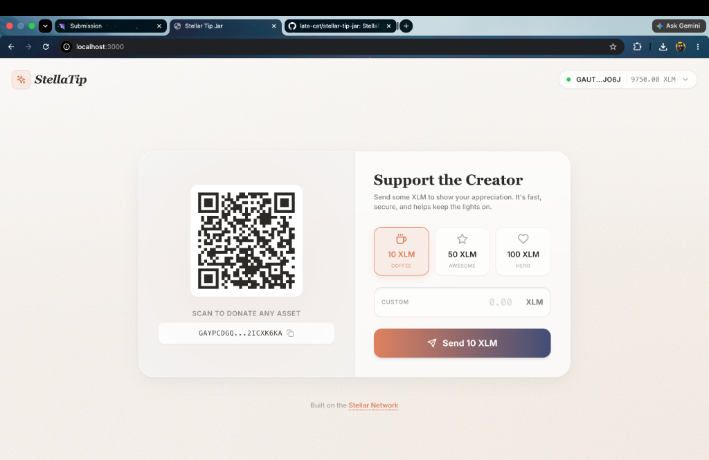
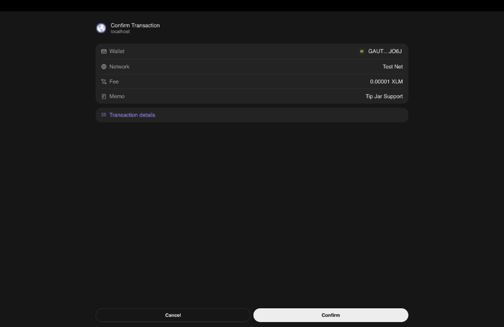
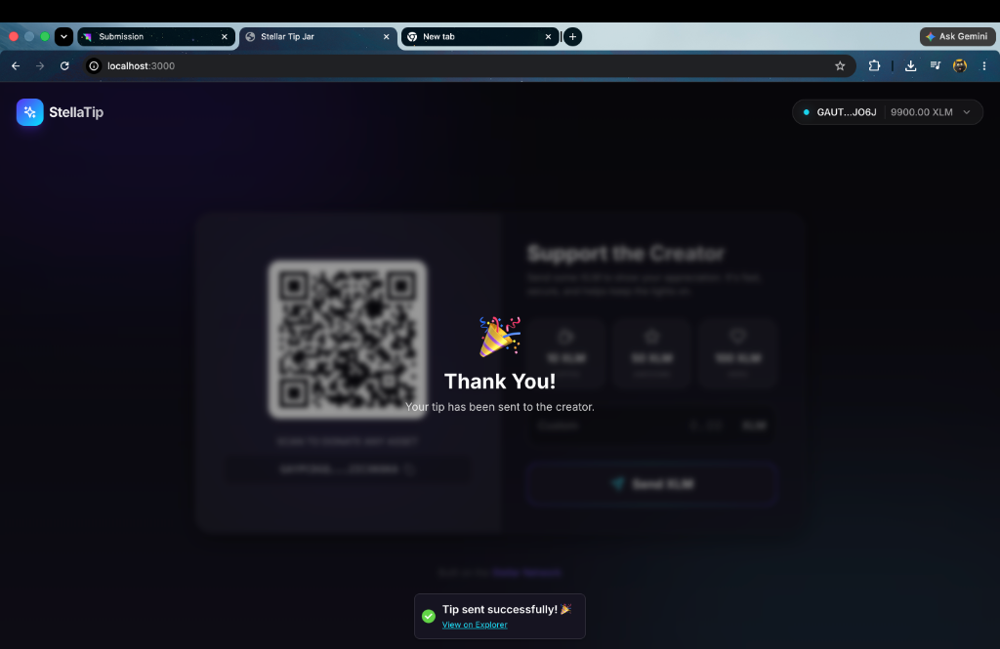

<div align="center">
  
  <h1>🌟 StellaTip: A Decentralized Tip Jar</h1>
  <p><strong>A premium, high-performance decentralized application built on the Stellar Testnet.</strong></p>
</div>

---

## 📖 Project Description

StellaTip is a modern, Web3-native Tip Jar application designed for creators to seamlessly accept XLM donations from their supporters. Leveraging the incredible speed and negligible fees of the Stellar network, this dApp provides a frictionless tipping experience. 

This project was engineered specifically as a submission for the **Stellar Level 1 - White Belt Challenge**.

### ✅ White Belt Requirements Fulfilled
This project successfully implements all required fundamental Stellar development concepts:
1. **Wallet Setup & Connection:** Integrates Freighter via `@creit.tech/stellar-wallets-kit`, including complete connect/disconnect flows.
2. **Balance Handling:** Queries the Stellar Horizon API to fetch and beautifully render the connected wallet's XLM balance directly in the UI.
3. **Transaction Flow:** Constructs, signs, and successfully executes native XLM payment operations on the Stellar Testnet.
4. **Transaction Feedback:** Provides comprehensive user feedback including loading states, success overlays, and direct links to the Stellar block explorer to verify the transaction hash.

---

## ✨ What Makes StellaTip Exceptional?
While basic templates simply get the job done, **StellaTip** was built to deliver an iconic, production-ready user experience. Here is what sets it apart:

- **💎 Premium "Cosmic Glass" UI:** Moves away from flat, generic designs by implementing beautiful Glassmorphism (translucent backgrounds, background blurs, and gradient meshes) using advanced Tailwind CSS utilities.
- **🎬 Butter-Smooth Animations:** Integrates `framer-motion` for highly polished component mount animations, hover states, and dynamic layout shifts, making the dApp feel alive and responsive.
- **⚡ Frictionless Tipping UX:** Features one-click preset donation tiers (Coffee, Awesome, Hero) alongside a robust custom amount input, dramatically reducing the friction of typing long numbers.
- **📱 Integrated QR Code Generation:** Dynamically generates a highly scannable, stylized QR code of the creator's address using `qrcode.react`, bridging the gap between desktop browsing and mobile wallet scanning.
- **🔔 Rich, Non-Blocking Notifications:** Uses `react-hot-toast` to provide real-time transaction lifecycle feedback (from "Awaiting Signature" to "Confirmed") without using disruptive browser alerts.

---

## 📸 Visual Walkthrough & Proof of Concept

Here is a visual demonstration proving all White Belt requirements have been met:

### 1. Wallet Connected State & Balance Displayed
*The wallet is successfully connected. The user's abbreviated public key and precise XLM balance are elegantly displayed in the top right pill on the main interface.*


### 2. Transaction Flow (Wallet Modal & Signing)
*When a transaction is initiated, the application connects to the user's selected wallet (e.g., Freighter) and prompts them to securely sign the transaction payload.*


### 3. Successful Testnet Transaction & User Feedback
*The transaction succeeds on the testnet! The user is presented with a success toast notification containing a clickable link to verify the transaction hash on the explorer, alongside a celebratory confetti overlay.*


---

## 🏗️ Project Structure

The codebase is organized using modern **Next.js 14 App Router** conventions for maximum scalability and separation of concerns:

```text
stellar-tip-jar/
├── app/
│   ├── globals.css         # Global Tailwind and Glassmorphism utilities
│   ├── layout.tsx          # Root layout including the Toaster notification provider
│   └── page.tsx            # Main application page (Dynamic imports & Layout)
├── components/
│   ├── TipJarCard.tsx      # Core logic: QR Code, Tipping Form, & Transaction builder
│   └── WalletConnect.tsx   # Header component handling Freighter integration & balances
├── lib/
│   └── stellar-helper.ts   # Abstraction layer for Stellar SDK and Wallets Kit
├── demo/img/               # Demonstration screenshots for documentation
├── tailwind.config.js      # Custom theme, colors, and animation configurations
└── package.json            # Project dependencies and scripts
```

---

## 🚀 Setup Instructions (Run Locally)

Want to run StellaTip on your own machine? Follow these simple steps:

### Prerequisites
- Node.js (v18 or higher recommended)
- A browser with the [Freighter Wallet](https://freighter.app/) extension installed.
- Your Freighter wallet must be set to the **Testnet** network.

### 1. Clone the Repository
```bash
git clone https://github.com/late-cat/stellar-tip-jar.git
cd stellar-tip-jar
```

### 2. Install Dependencies
```bash
npm install
```

### 3. Configure the Receiver Address (Optional)
By default, the tip jar sends funds to a placeholder testnet account. To receive funds yourself, create a `.env.local` file in the root directory and add your public key:
```env
NEXT_PUBLIC_RECEIVER_KEY=your_public_key_here
```

### 4. Start the Development Server
```bash
npm run dev
```

### 5. Open the Application
Navigate to [http://localhost:3000](http://localhost:3000) in your browser. Connect your wallet, grab some testnet XLM from the faucet, and try sending a tip!

---

## 🛠️ Technology Stack
- **Framework:** Next.js 14 (App Router)
- **Styling:** Tailwind CSS
- **Animations:** Framer Motion
- **Blockchain SDK:** `@stellar/stellar-sdk`
- **Wallet Integration:** `@creit.tech/stellar-wallets-kit`
- **Icons & UI:** `lucide-react`, `react-hot-toast`

---

<div align="center">
  <p>Built with ❤️ on the Stellar Network</p>
</div>
